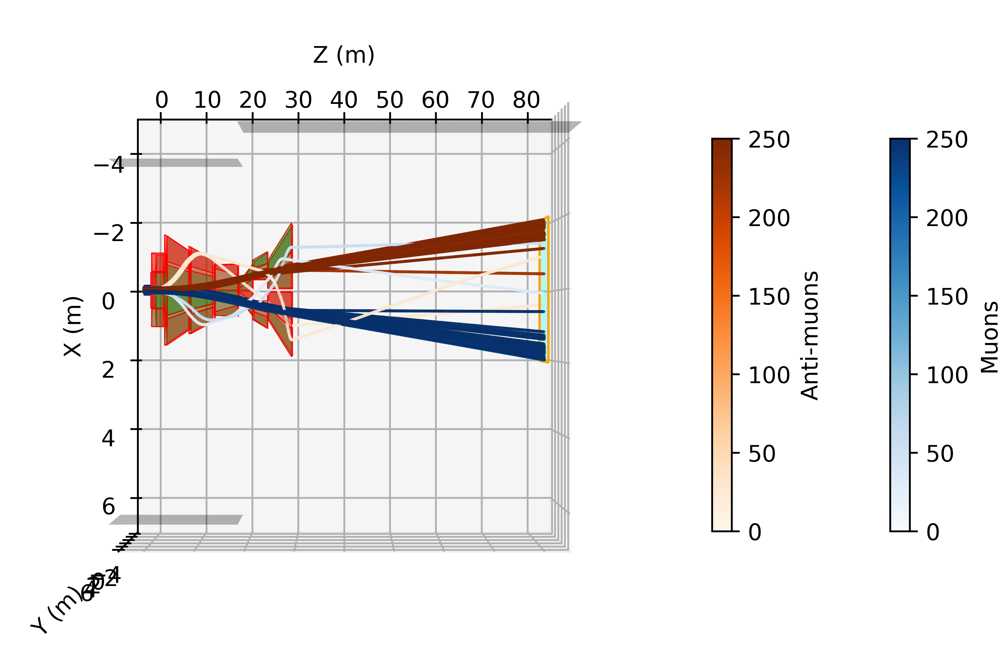

# Muon Shield for the SHiP experiment 





## Envrionment
For non-GUI access (such as on servers), download snoopy_geant_slurm.sif from the following location:

[Containers](https://uzh-my.sharepoint.com/:f:/g/personal/luis_felipe_cattelan_physik_uzh_ch/EjWSU34WfZRLiJQ98M3XD58B5BOe7T9fRzW2ffz93Bi9nQ?e=dfgTXF)

If you are using uzh-physik cluster, shell the container by executing `shell_container.sh` (be sure to have Apptainer installed).

For other clusters, modify the commands accordingly. You should include every directory
you need access to with `-B` option.

Running on the MacBook is also easy, the default binary release from Geant4 works fine. And the rest of the packages can
be installed simply via pip3.

Inside the container, build the C++ code by executing the script `build_cpp.sh`.

### Data

The input muons are, ideally, the ones produced from simulations performed by the SHiP collaboration. The muons need to be send to run_simulation with the shape [px,py,pz,x,y,z,pdg_id,weight], where weight is optional. 

### Running
The main script to run simulation is:

```
python3 muons_and_matter/muons_and_matter.py
```

Be aware of the possible arguments (run `python3 muons_and_matter/muons_and_matter.py -h`). The default is to run in parallel with 45 CPU cores through multiprocessing library. Be sure to change accordingly with your computer limitations.

The script for building the detector can be found in [muons_and_matter/lib/ship_muon_shield_customfield.py](muons_and_matter/lib/ship_muon_shield_customfield.py), while the script that controls the magnetic field simulations can be found in [muons_and_matter/lib/magnet_simulations.py](muons_and_matter/lib/magnet_simulations.py). For more details about the construction of the muon shield, refer to the [main SHIP software](https://github.com/ShipSoft/FairShip), and for details on the FEM magnetic field simulator please refer to the [Snoo.py repository](https://gitlab.cern.ch/meliebsc/snoopy/).
